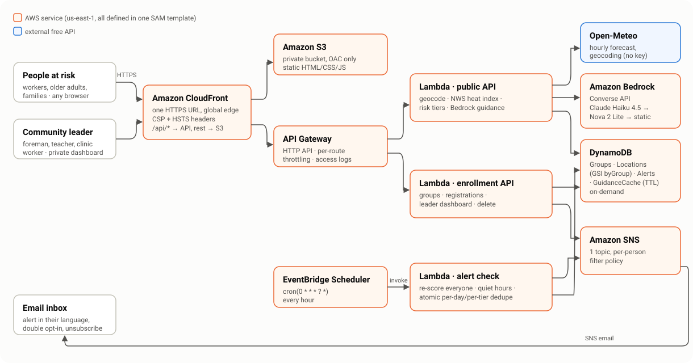

# HeatShield

**A weather app tells you it's 41 °C. HeatShield tells you what to do about it: for your body, your job, and in your language, before the hottest hours arrive.**

**Live app: __SITE_URL__**

`#social-good` (Climate resilience) · `#community`

---

## The problem

Heat is linked to an estimated **489,000 deaths a year** worldwide ([WHO](https://www.who.int/news-room/fact-sheets/detail/climate-change-heat-and-health), 2000–2019 average). **2.4 billion of the world's 3.4 billion workers** are likely to be exposed to excessive heat at work, and heat causes an estimated **18,970 work-related deaths a year** ([ILO, April 2024](https://www.ilo.org/resource/news/newly-launched-global-campaign-tackles-impact-heat-stress-workers-worldwide)). Those most at risk are older adults, people with chronic illness, outdoor and manual workers, and people in informal housing without cooling (WHO).

These are exactly the people least likely to get a useful warning. A forecast says "heat index 42 °C". It does not tell a delivery rider in Dubai, a grandmother living alone in Delhi, or a farm crew in Phoenix *what to do between now and tonight*, in a language they read comfortably.

## What HeatShield does: the last mile from forecast to action

1. **Real risk, per person.** Live hourly forecast (temperature + humidity) → the US National Weather Service heat-index formula → NWS risk tier, hour by hour, including when risk will **rise** and **peak**, and the person's **risky hours** today.
2. **Personal thresholds.** Older adults, pregnant people, young children and people with chronic conditions are warned **one tier earlier** than the general public (table below).
3. **An action plan in their language.** Amazon Bedrock writes a headline, three concrete steps and the warning signs to watch, grounded in CDC/NIOSH guidance, in any of **13 languages** (Arabic and Urdu shown right-to-left).
4. **Warnings they don't have to ask for.** Every hour, EventBridge Scheduler re-checks everyone and Amazon SNS emails people whose risk reaches their level: at most one alert per level per day, never between 21:00 and 06:00 their time.
5. **One person watching out for many.** A foreman, teacher or clinic worker creates a group, shares one invite link, and sees everyone's live risk on a private dashboard, worst first.

## Try it in 60 seconds

| What | Link |
|---|---|
| A live result (Karachi, outdoor worker, Urdu) | __SITE_URL__/?place=Karachi%2C%20Pakistan&lat=24.86&lon=67.01&profile=outdoor_worker&lang=ur |
| Same idea, Arabic, right-to-left | __SITE_URL__/?place=Dubai%2C%20UAE&lat=25.2&lon=55.27&profile=outdoor_worker&lang=ar |
| The community-leader dashboard (read-only demo, 10 fictional members in 10 real hot cities) | __DEMO_URL__ |
| Health endpoint | __SITE_URL__/api/health |

Everything on those pages is computed live from the current forecast. Nothing is hard-coded.

## Architecture



Fully serverless, defined in one AWS SAM template ([infra/template.yaml](infra/template.yaml)), deployed with one command.

| AWS service | Why it is the right tool here |
|---|---|
| **Amazon Bedrock** (Converse API) | Turns a structured risk assessment into specific, localized, profile-aware guidance. This is the part a CRUD app cannot do. Claude Haiku 4.5 (`us.anthropic.claude-haiku-4-5-20251001-v1:0`) is primary; Amazon Nova 2 Lite (`us.amazon.nova-2-lite-v1:0`) is the automatic fallback; hand-written guidance is the last resort. |
| **AWS Lambda** (Node.js 22, arm64/Graviton) | Three functions with separate least-privilege roles: public API, enrollment API, hourly alert check. Zero runtime dependencies. |
| **Amazon API Gateway** (HTTP API) | Routes plus per-route throttling on a public endpoint that calls a paid model. |
| **Amazon DynamoDB** (on-demand) | Groups, Locations (sparse GSI per group), Alerts (atomic dedupe), GuidanceCache (TTL). |
| **Amazon EventBridge Scheduler** | The hourly re-check that makes this *early warning* rather than a dashboard you must remember to open. |
| **Amazon SNS** | Email alerts. One topic; each subscriber has a filter policy on their own ID, so a publish reaches exactly one person. AWS handles double opt-in and unsubscribe. |
| **Amazon S3 + CloudFront** | Private bucket (Origin Access Control), one HTTPS URL for site and API, strict CSP and HSTS headers, served from every edge location because users are worldwide. |
| **AWS X-Ray, CloudWatch Logs** | Tracing on every function; structured JSON logs with 14-day retention. |

## The science (so the warnings can be trusted)

- **Heat index:** the NWS Rothfusz regression with both NWS humidity adjustments ([source](https://www.wpc.ncep.noaa.gov/html/heatindex_equation.shtml)). Unit tests pin it to 16 reference values generated independently with [MetPy](https://unidata.github.io/MetPy/), covering both adjustment cases.
- **Tiers:** NWS classification ([source](https://www.weather.gov/ama/heatindex)): Caution ≥ 80 °F (26.7 °C), Extreme Caution ≥ 90 °F (32.2 °C), Danger ≥ 103 °F (39.4 °C), Extreme Danger ≥ 125 °F (51.7 °C).
- **Profile-adjusted alert thresholds** (the heat index is objective; *when we warn you* is personal):

| Profile | Alerted from | Why |
|---|---|---|
| Older adult (65+) | Caution | Less able to regulate body temperature; disproportionately represented in heat deaths |
| Chronic condition | Caution | Heart, lung, kidney disease, diabetes and some medicines raise risk |
| Young child | Caution | Depends on others; can't cool themselves or ask for water |
| Pregnant | Caution | Recognized heat-vulnerable group |
| Outdoor worker | Extreme Caution | Hours of exposure and exertion; NWS values assume shade, and full sun can add up to 15 °F |
| General public | Extreme Caution | Baseline |

- **Early warning, not current weather:** 6-hour trend, 24-hour peak time, contiguous risky-hours window, 4-day outlook, and whether the night stays above 20 °C (a "tropical night": no overnight relief).

## Why the AI layer is built this way

- **No user text ever reaches the model.** The prompt is built only from enumerated values: tiers, clock hours, profile, language, UV bucket. There is no prompt-injection surface, and the space of possible prompts is finite.
- **That makes caching exact and spend bounded.** Guidance is cached in DynamoDB under a hash of the exact prompt inputs (6-hour TTL). Two workers at the same site get the same advice from one Bedrock call, and a public endpoint cannot be abused to mint unlimited unique (billable) prompts.
- **Grounded, not creative.** The system prompt gives the model a fixed list of CDC/NIOSH/NWS facts (for example 1 cup / 240 ml every 15–20 minutes and no more than about 1.5 L an hour for working in heat, check on older adults twice a day, heat-stroke signs) and forbids invented numbers, medicines or phone numbers.
- **Validated before anyone sees it.** Output must be JSON of the right shape and length, *and in the requested script*: Arabic requested must come back in Arabic script. Failures fall through Claude → Nova → pre-written guidance. A person at risk never sees a blank screen.

## Security and privacy

- Coordinates are rounded to ~1 km before they are stored or sent anywhere.
- **Email addresses are never stored in our database.** They live only inside the SNS subscription. Every alert has an unsubscribe link, and one click on the personal page deletes the registration, alert history and subscription.
- No accounts or passwords. Group dashboards and personal pages use 192-bit bearer links; only SHA-256 hashes are stored, comparisons are constant-time, and the secret lives in the URL `#fragment`, which browsers never send to servers.
- Strict Content-Security-Policy (`script-src 'self'`, no inline scripts), HSTS, `X-Frame-Options: DENY`; all user text is rendered with `textContent`.
- The public demo group is read-only, so the demo dashboard link can be shared without being vandalized.

## How Claude Code built this

The development process is logged with real command output in [docs/BUILD_LOG.md](docs/BUILD_LOG.md). Highlights:

1. **Connected to AWS through the official AWS Agent Toolkit:** browser `aws login`, then the AWS MCP Server (`aws-mcp ✔ Connected`). The Bedrock model IDs in this repo came from a real `ListInferenceProfiles` call made *through the MCP server*, not from memory.
2. **Checked facts before coding them:** NWS formula, CDC/NIOSH guidance, WHO/ILO statistics, CloudFront policy IDs, and Open-Meteo response shapes were all fetched from primary sources first.
3. **Proved the heat-index code against an independent implementation** (MetPy), and found by reading MetPy's source that its low-temperature shortcut differs from the NWS text.
4. **Tested the UI in a real browser.** It drove headless Chrome through the whole flow, including a `<script>` tag as a member name and a 390 px Arabic right-to-left layout. The screenshots exposed three layout bugs, which were fixed the same session.
5. **Found real AWS constraints and designed around them.** The brand-new account was still "being verified", which blocked Anthropic models on Bedrock while Amazon Nova worked. The Claude → Nova fallback chain meant the app shipped anyway.

## Run it yourself

```bash
npm test                       # 46 unit tests, no AWS needed
npm run dev                    # http://localhost:8787 — real weather, in-memory data, Bedrock stubbed
npm run deploy                 # test -> lint -> sam build/deploy -> upload site -> smoke-test the public URL
npm run seed:demo              # create the read-only demo group through the live API
```

Deploying needs the AWS CLI, AWS SAM CLI and Node 22+. Stack parameters (Bedrock model IDs) are in [infra/params.json](infra/params.json).

Manually trigger one real alert (used for the demo proof):

```bash
aws lambda invoke --function-name <AlertCheckFunctionName> \
  --cli-binary-format raw-in-base64-out --payload '{"forceLocationId":"<locationId>"}' out.json
```

## Honest limitations

- The heat index is a shade value. Occupational standards also use WBGT (wet-bulb globe temperature), which needs solar and wind inputs that we don't have. We state the "full sun adds up to 8 °C / 15 °F" caveat on screen and in guidance instead of pretending otherwise.
- AI guidance passes structural and script checks automatically, but meaning can only be checked by a person. Lower-resource languages are less reliable: in our own test, Amazon Nova's Bengali and Swahili output contained real word errors, while its Spanish, Hindi, Arabic and Chinese output was reviewed and read correctly.
- Email is the live alert channel. SMS via SNS needs registered origination numbers in many countries (weeks of paperwork), so we do not claim it.
- HeatShield gives safety information, not medical care.
- Weather data: [Open-Meteo](https://open-meteo.com/) (CC BY 4.0, free for non-commercial use).

## Repository map

```
frontend/            static site (no framework): index, join, group (leader dashboard), me (personal page)
infra/template.yaml  the whole AWS stack (SAM)
infra/functions/     Lambda code: lib/heat.mjs (risk engine), lib/guidance.mjs (Bedrock), lib/alert-runner.mjs, ...
infra/tests/         node --test suite
scripts/             deploy, seed-demo, local dev server
docs/                BUILD_LOG.md (development process + AWS connection proof), architecture.svg
.claude/skills/      the playbooks Claude Code followed for each part of the build
```

## License

MIT, see [LICENSE](LICENSE).
