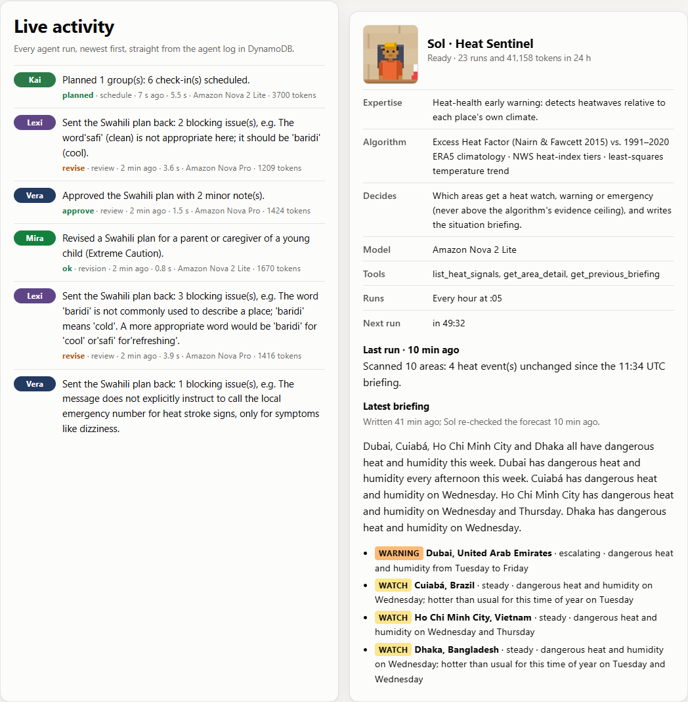
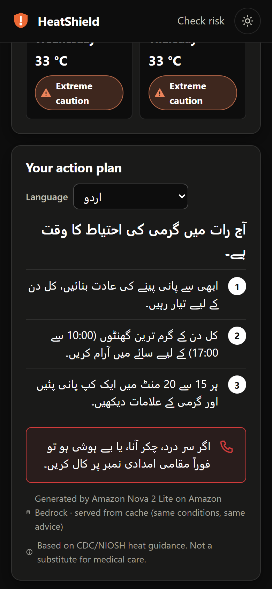

# HeatShield

**A weather app tells you it's 41 °C. HeatShield tells you what to do about it: for your body, your job, and in your language, before the hottest hours arrive.** Six AI agents run it around the clock on AWS, and you can watch them work.

**Live app: https://d3tda9dyutl7ux.cloudfront.net** · **Agent HQ (the agents, live): https://d3tda9dyutl7ux.cloudfront.net/agents.html**

`#social-good` (Climate resilience) · `#community`

---

## The problem

Heat is linked to an estimated **489,000 deaths a year** worldwide ([WHO](https://www.who.int/news-room/fact-sheets/detail/climate-change-heat-and-health), 2000–2019 average). **2.4 billion of the world's 3.4 billion workers** are likely to be exposed to excessive heat at work, and heat causes an estimated **18,970 work-related deaths a year** ([ILO, April 2024](https://www.ilo.org/resource/news/newly-launched-global-campaign-tackles-impact-heat-stress-workers-worldwide)). Those most at risk are older adults, people with chronic illness, outdoor and manual workers, and people in informal housing without cooling (WHO).

These are exactly the people least likely to get a useful warning. A forecast says "heat index 42 °C". It does not tell a delivery rider in Dubai, a grandmother living alone in Delhi, or a farm crew in Phoenix *what to do between now and tonight*, in a language they read comfortably.

## What HeatShield does: the last mile from forecast to action

1. **Real risk, per person.** Live hourly forecast (temperature + humidity) → the US National Weather Service heat-index formula → NWS risk tier, hour by hour, including when risk will **rise** and **peak**, and the person's **risky hours** today.
2. **Personal thresholds.** Older adults, pregnant people, young children and people with chronic conditions are warned **one tier earlier** than the general public (table below).
3. **An action plan in their language, checked before anyone sees it.** Amazon Bedrock writes a headline, three concrete steps and the warning signs to watch, grounded in vetted CDC/NIOSH guidance, in any of **13 languages** (Arabic and Urdu right-to-left). Two reviewer agents check the language and the safety of every new plan first.
4. **Warnings they don't have to ask for.** Every hour, EventBridge Scheduler re-checks everyone and Amazon SNS emails people whose risk reaches their level: at most one alert per level per day, never between 21:00 and 06:00 their time.
5. **One person watching out for many.** A foreman, teacher or clinic worker creates a group, shares one invite link, and sees everyone's live risk on a private dashboard, worst first. An agent plans who they should check on first.

## Six AI agents, running 24/7

Each agent owns a real job. **An algorithm does the part that must be exact; a model on Amazon Bedrock does the part that needs judgment; code, not the model, makes the final call.**

| Agent | Runs | Job | The exact part (algorithm) | The judgment part (model) | What code guarantees |
|---|---|---|---|---|---|
| **Sol**, Heat Sentinel | every hour | Finds heatwaves in every watched city and writes the situation briefing | [Excess Heat Factor](https://pmc.ncbi.nlm.nih.gov/articles/PMC4306859/) (Nairn & Fawcett 2015) against each city's own 1991–2020 climate, NWS heat-index tiers, least-squares temperature trend | Which areas need a watch, warning or emergency; the briefing | The level can never exceed the algorithm's evidence ceiling; trends (new/steady/escalating/easing) and each event's headline are computed from the numbers |
| **Mira**, Health Advisor | every new plan | Writes the personal action plan | Okapi **BM25** retrieval over a library of 21 vetted CDC/NIOSH/NWS facts | The plan, in the person's language | Only enumerated values reach the prompt (no user text); JSON shape, length and script are validated |
| **Lexi**, Language Reviewer | every new plan | Checks the language | Multinomial **naive-Bayes language ID** (free, before any model call) | Literal back-translation and a categorised issue list | Only real errors block (invented words, misspellings, wrong language); wording notes go back as suggestions |
| **Vera**, Safety Reviewer | every new plan | Checks the safety | Deterministic detectors for phone numbers, medicines and doses | Review against the full vetted library with a fixed rubric, then a second reading of any harm objection | Only rule violations block; a harm objection must point at words that are really in the message |
| **Kai**, Community Coordinator | every 3 hours, or on request | Plans who a group leader should check on first | Logistic **urgency score** + **earliest-deadline-first** scheduling across time zones | The wording of each check-in | The model cannot reorder or invent people; names never reach the model |
| **Otto**, Ops Watchdog | every 15 minutes | Keeps the site up | 5 live probes, **EWMA control charts** on latency, heartbeat checks for every agent, CloudWatch log scans | Incident reports (title, likely cause, action) | Triage is deterministic; a model is called only for a new incident; setup states (a model not yet enabled) are notes, not outages |

A seventh, non-AI worker, the **Dispatcher**, runs the hourly alert check and sends the emails.

**How they work together.** Agents coordinate through shared state in DynamoDB, not by calling each other: Sol publishes heat events that Kai reads; Mira's drafts go to Lexi and Vera, and blocking issues go back to Mira for up to two revisions (if they still fail, the person gets pre-written vetted advice, never a blank screen); Otto reads everyone's heartbeat from the agent log and, when something breaks, writes an incident report that appears on Agent HQ and is published to an SNS ops topic.

**Agent HQ** ([/agents.html](https://d3tda9dyutl7ux.cloudfront.net/agents.html)) shows all of this live: a pixel-art office drawn in code from the real agent log (status lamps, speech from each agent's last real run, a wall map of Sol's cities and heat events), the activity feed, each agent's details, and buttons that run real agents on AWS behind shared cooldowns. "Give the team a task" asks for a plan and replays the review rounds the server actually ran.


| Live activity and Sol's briefing | Agent HQ on a phone |
|---|---|
|  |  |

**Measured, not assumed.** In the first live measurements, the reviewers were sending plans back for the wrong reasons: 22 of Lexi's 24 blocking objections were really about facts, not language (she read a headline about *today's* peak as a claim about the risk *right now*), and Vera objected that a head covering raises body temperature, or blocked "a fan as the main cooling" while quoting a sentence that mentions no fan. We recalibrated in deploy-and-measure rounds with [scripts/eval-guidance.mjs](scripts/eval-guidance.mjs) (one real plan per language): language and safety split cleanly between the two reviewers, code keeps wording complaints and omissions as notes, and a harm objection must survive a second reading that points at the exact words.

| | New plans | Published as AI plans | Pre-written fallback |
|---|---|---|---|
| Before calibration (29 Sep, 11:35–11:43 UTC) | 5 | 1 | 4, including both featured examples (Urdu, Arabic) |
| After calibration (29 Sep, four runs, 13 languages) | 52 | **47 (90%)** | 5, each with a real error the reviewers caught: invented Swahili words (three times), "ice" where "cool" was meant, "thunder" for "confusion" among Hindi heat-stroke signs, a wrong decimal separator |

## Try it in 60 seconds

| What | Link |
|---|---|
| **Agent HQ**: the six agents working live; give them a task | https://d3tda9dyutl7ux.cloudfront.net/agents.html |
| A live result (Karachi, outdoor worker, Urdu) | https://d3tda9dyutl7ux.cloudfront.net/?place=Karachi%2C%20Pakistan&lat=24.86&lon=67.01&profile=outdoor_worker&lang=ur |
| Same idea, Arabic, right-to-left | https://d3tda9dyutl7ux.cloudfront.net/?place=Dubai%2C%20UAE&lat=25.2&lon=55.27&profile=outdoor_worker&lang=ar |
| The community-leader dashboard (read-only demo, 10 fictional members in 10 real hot cities) | https://d3tda9dyutl7ux.cloudfront.net/group.html#g=5NpOU_pMXAK_&k=Q51QdY6DIZK7P4pLCF9B8KAiofrIcFgj |
| The agents' live state as JSON | https://d3tda9dyutl7ux.cloudfront.net/api/agents |
| Health endpoint | https://d3tda9dyutl7ux.cloudfront.net/api/health |

Everything on those pages is computed live from the current forecast and the agents' real runs. Nothing is hard-coded.

| Personal result: Dubai, outdoor worker, Arabic | Community-leader dashboard | Mobile, Urdu, dark mode |
|---|---|---|
|  |  |  |

*Screenshots of the live site, captured by automated headless-Chrome runs (28 and 29 Sep 2026).*

## Architecture


Fully serverless, defined in one AWS SAM template ([infra/template.yaml](infra/template.yaml)), deployed with one command.

| AWS service | Why it is the right tool here |
|---|---|
| **Amazon Bedrock** (Converse API, tool use) | The judgment half of every agent. **Amazon Nova 2 Lite** writes plans and runs Sol, Kai and Otto; **Amazon Nova Pro** reviews, so a different model checks the writer's work (it also writes a plan if Nova 2 Lite fails twice). **Claude Haiku 4.5** is configured as the primary writer and takes over automatically once Anthropic model access is enabled on the account; until then every plan falls through to Nova. Pre-written vetted guidance is the last resort. |
| **AWS Lambda** (Node.js 22, arm64/Graviton) | Six functions with separate least-privilege roles: public API, enrollment API, Dispatcher (hourly alerts), Sol, Kai and Otto. Zero runtime dependencies beyond the AWS SDK. |
| **Amazon API Gateway** (HTTP API) | Routes plus per-route throttling on a public endpoint that calls paid models; the agent-run buttons are throttled harder and also have shared cooldowns. |
| **Amazon DynamoDB** (on-demand) | Groups, Locations (sparse GSI per group), Alerts (atomic dedupe), GuidanceCache (TTL), and **AgentLog**: every agent run (14-day TTL) plus the shared state agents coordinate through. |
| **Amazon EventBridge Scheduler** | Four schedules: Dispatcher hourly, Sol hourly at :05, Kai every 3 hours, Otto every 15 minutes. This is what makes it *early warning* rather than a dashboard you must remember to open. |
| **Amazon SNS** | Email alerts (one topic; each subscriber has a filter policy on their own ID, so a publish reaches exactly one person; AWS handles double opt-in and unsubscribe) and a separate ops topic that Otto publishes incident reports to (subscribe an on-call email or chat channel to receive them). |
| **Amazon CloudWatch Logs** | Structured JSON logs; Otto reads them (`FilterLogEvents`) to find errors and failing models, and reads the actual error before deciding what it means. |
| **Amazon S3 + CloudFront** | Private bucket (Origin Access Control), one HTTPS URL for site and API, strict CSP and HSTS headers, served from every edge location because users are worldwide. |
| **AWS X-Ray** | Tracing on every function. |

## The science (so the warnings can be trusted)

- **Heat index:** the NWS Rothfusz regression with both NWS humidity adjustments ([source](https://www.wpc.ncep.noaa.gov/html/heatindex_equation.shtml)). Unit tests pin it to 16 reference values generated independently with [MetPy](https://unidata.github.io/MetPy/), covering both adjustment cases.
- **Tiers:** NWS classification ([source](https://www.weather.gov/ama/heatindex)): Caution ≥ 80 °F (26.7 °C), Extreme Caution ≥ 90 °F (32.2 °C), Danger ≥ 103 °F (39.4 °C), Extreme Danger ≥ 125 °F (51.7 °C).
- **Heatwaves relative to local climate:** Sol computes the Excess Heat Factor (Nairn & Fawcett 2015, the method behind Australia's national heatwave service) against each city's own 1991–2020 95th percentile from the ERA5 reanalysis, because 41 °C is normal in Dubai in August and a crisis in Paris.
- **Profile-adjusted alert thresholds** (the heat index is objective; *when we warn you* is personal):

| Profile | Alerted from | Why |
|---|---|---|
| Older adult (65+) | Caution | Less able to regulate body temperature; disproportionately represented in heat deaths |
| Chronic condition | Caution | Heart, lung, kidney disease, diabetes and some medicines raise risk |
| Young child | Caution | Depends on others; can't cool themselves or ask for water |
| Pregnant | Caution | Recognized heat-vulnerable group |
| Outdoor worker | Extreme Caution | Hours of exposure and exertion; NWS values assume shade, and full sun can add up to 15 °F |
| General public | Extreme Caution | Baseline |

- **Early warning, not current weather:** 6-hour trend, 24-hour peak time, contiguous risky-hours window, 4-day outlook, and whether the night stays above 20 °C (a "tropical night": no overnight relief).

## Why the AI layer is built this way

- **No user text ever reaches a model.** Prompts are built only from enumerated values: tiers, clock hours, profile, language, UV bucket. There is no prompt-injection surface, and group members' names never leave the leader's dashboard.
- **Caching is exact and spend is bounded.** Approved plans are cached in DynamoDB under a hash of the exact prompt inputs, so two workers at the same site get the same advice from one set of Bedrock calls, and a public endpoint cannot be used to mint unlimited unique prompts.
- **Grounded, not creative.** Mira gets only facts retrieved from the vetted library (for example 1 cup / 240 ml every 15–20 minutes and no more than about 1.5 L an hour for working in heat); Vera judges against the whole library. No invented numbers, medicines or phone numbers: a detector blocks them before any model is asked.
- **Code decides what blocks.** Reviewer models label each issue; code decides whether it blocks publication. That is how the calibration above could be precise, tested and reversible.
- **Every failure has a path.** Unusable model output gets one more sample, then the next model, then pre-written guidance. A person at risk never sees a blank screen.

## What a live system taught us

The agents run on real forecasts and real traffic, so they hit real problems. Each one became a fix and a regression test named after the event ([infra/tests/regressions.test.mjs](infra/tests/regressions.test.mjs)). Examples:

- **Open-Meteo rate limits.** Open-Meteo limits requests per IP, and Lambda shares outbound IPs with other AWS customers. Sol now retries after a pause and keeps a city's last good data (marked stale, up to 3 hours), instead of silently dropping a heat watch.
- **A rule that never fired.** Sol's "rewrite the briefing every 6 hours" check measured a timestamp that every re-check refreshed.
- **Right diagnosis, wrong level.** Otto first called a model that was not yet enabled "transient unavailability" and marked the whole site degraded. It now reads the actual error and reports a setup note.
- **Words that were wrong.** A model headline put dangerous heat on a Thursday that the forecast rated one tier lower, so headlines are now written from the numbers. The model also copied its own awkward phrasing from the previous briefing, so it now sees only levels, not prose.

## Cost

Measured from the agent log on the busiest testing day (29 Sep, about 90 new plans): **Bedrock cost about US$0.72** (Nova 2 Lite US$0.33/US$2.75 and Nova Pro US$0.80/US$3.20 per million input/output tokens, from the AWS Price List API). That works out to about **US$0.01 per new plan** (writer + two reviewers, with revisions); cached plans cost nothing. With no visitors, the background agents cost about **US$0.05 a day**. Otto used a model 4 times in 74 runs, and Sol re-uses its briefing while nothing changes. Lambda, DynamoDB on-demand, API Gateway, CloudFront and SNS email stay within or near the free tier at this scale.

## Security and privacy

- Coordinates are rounded to ~1 km before they are stored or sent anywhere; Sol's public map uses city-level coordinates (~11 km) and shows no head counts.
- **Email addresses are never stored in our database.** They live only inside the SNS subscription. Every alert has an unsubscribe link, and one click on the personal page deletes the registration, alert history and subscription. A leader can delete the whole group, with every member's data, from the dashboard.
- No accounts or passwords. Group dashboards and personal pages use 192-bit bearer links; only SHA-256 hashes are stored, comparisons are constant-time, and the secret lives in the URL `#fragment`, which browsers never send to servers.
- Strict Content-Security-Policy (`script-src 'self'`, no inline scripts or styles), HSTS, `X-Frame-Options: DENY`; all user text is rendered with `textContent`.
- IAM: one managed policy allows `bedrock:InvokeModel` on exactly the inference profiles HeatShield uses; Otto can read only this stack's log groups.
- The public demo group is read-only, so the demo dashboard link can be shared without being vandalized.

## How Claude Code built this

The development process is logged with real command output in [docs/BUILD_LOG.md](docs/BUILD_LOG.md). Highlights:

1. **Connected to AWS through the official AWS Agent Toolkit:** browser `aws login`, then the AWS MCP Server. The Bedrock model IDs came from a real `ListInferenceProfiles` call made through the MCP server, and the agents' live behaviour was investigated through it too (DynamoDB agent-log queries, CloudWatch Logs searches, Lambda invocations).
2. **Checked facts before coding them:** NWS formula, the Excess Heat Factor paper, CDC/NIOSH guidance, WHO/ILO statistics, model prices and Open-Meteo response shapes were all fetched from primary sources first.
3. **Proved the heat-index code against an independent implementation** (MetPy), and found by reading MetPy's source that its low-temperature shortcut differs from the NWS text.
4. **Tested in a real browser, against production.** Headless Chrome drives the whole flow, from checking risk to deleting a group ([scripts/e2e/](scripts/e2e/)), plus every Agent HQ button, and fails on any console error, broken step or horizontal overflow. Earlier runs also covered a `<script>` tag as a member name and a 390 px Arabic right-to-left layout.
5. **Deployed, measured, and fixed in loops.** Every agent change above was deployed, run live, read back from DynamoDB and CloudWatch, and checked against the forecast before it was called done.

## Run it yourself

```bash
npm test                        # 100 unit and regression tests, no AWS needed
npm run dev                     # http://localhost:8787 — real weather, in-memory data, Bedrock stubbed
HEATSHIELD_PROXY=https://<site> PORT=8788 node scripts/dev-server.mjs   # local UI against the live agents
npm run deploy                  # test -> lint -> sam build/deploy -> upload site -> smoke test -> Otto post-deploy check
node scripts/eval-guidance.mjs --shift 1                                # live review-pipeline evaluation (about US$0.01 a plan)
npm i --no-save playwright-core && node scripts/e2e/live-flow.cjs      # end-to-end test in your installed Chrome
node scripts/e2e/agent-hq.cjs --run-agents                              # Agent HQ, pressing every button (a few US cents)
npm run seed:demo               # create the read-only demo group through the live API
```

Deploying needs the AWS CLI, AWS SAM CLI and Node 22+. Stack parameters (Bedrock model IDs) are in [infra/params.json](infra/params.json).

Manually trigger one real alert (used for the demo proof):

```bash
aws lambda invoke --function-name <AlertCheckFunctionName> \
  --cli-binary-format raw-in-base64-out --payload '{"forceLocationId":"<locationId>"}' out.json
```

## Honest limitations

- The heat index is a shade value. Occupational standards also use WBGT (wet-bulb globe temperature), which needs solar and wind inputs that we don't have. We state the "full sun adds up to 8 °C / 15 °F" caveat on screen and in guidance instead of pretending otherwise.
- Reviewer agents are models too. After calibration, 90% of new plans in our 13-language evaluation were published and every rejected one contained a real error, but a model reviewer can still miss an error or object to a correct sentence. Swahili is the writer's weakest language.
- **Pre-written fallback advice exists in English, Spanish and French only.** If a plan in another language is rejected or no model is available, the person sees English advice with a notice. We chose not to ship hand-made translations of safety advice that no native speaker has checked.
- Claude Haiku 4.5 is wired as the primary writer, but Anthropic models need a one-time use-case form on the AWS account; until it is submitted, Amazon Nova writes every plan (Otto reports this as a setup note).
- Email is the live alert channel. SMS via SNS needs registered origination numbers in many countries (weeks of paperwork), so we do not claim it.
- Agent HQ is an illustration: the office is pixel art, but every status, line of speech, map dot and number in it comes from real agent runs.
- HeatShield gives safety information, not medical care.
- Weather data: [Open-Meteo](https://open-meteo.com/) (CC BY 4.0, free for non-commercial use; historical climate from the ERA5 reanalysis via Open-Meteo).

## Repository map

```
frontend/                  static site (no framework): index, join, group (leader dashboard), me (personal page),
                           agents.html + js/pixel-office.js, js/office-live.js, js/agents-page.js (Agent HQ)
infra/template.yaml        the whole AWS stack (SAM)
infra/functions/lib/       heat.mjs (risk engine), guidance.mjs (Mira + review loop), alert-runner.mjs (Dispatcher),
                           agent-runtime.mjs (Bedrock tool-use loop), agent-log.mjs, agents-api.mjs
infra/functions/lib/agents/        sentinel (Sol), language-reviewer (Lexi), safety-reviewer (Vera),
                                   coordinator (Kai), watchdog (Otto), facts.mjs (the vetted library)
infra/functions/lib/algorithms/    ehf.mjs, bm25.mjs, langid.mjs, stats.mjs (OLS, EWMA)
infra/tests/               node --test suite, including regressions.test.mjs (one test per live incident)
scripts/                   deploy, eval-guidance, seed-demo, local dev server; e2e/ (headless-Chrome tests of the live site)
docs/                      BUILD_LOG.md (development process + AWS connection proof), architecture.svg, screenshots
.claude/skills/            the playbooks Claude Code followed for each part of the build
```

## License

MIT, see [LICENSE](LICENSE).
