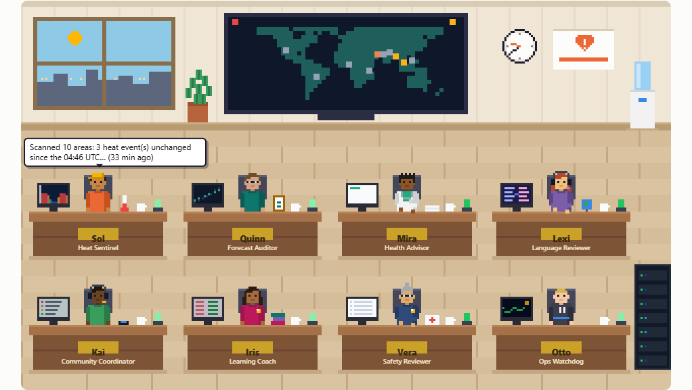
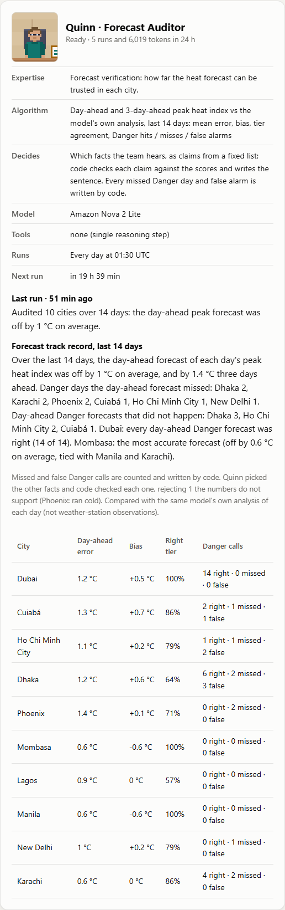
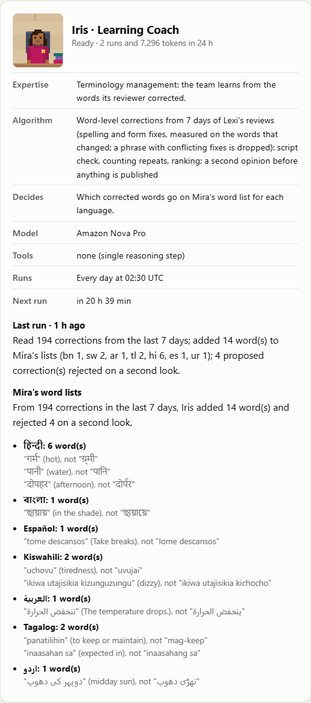
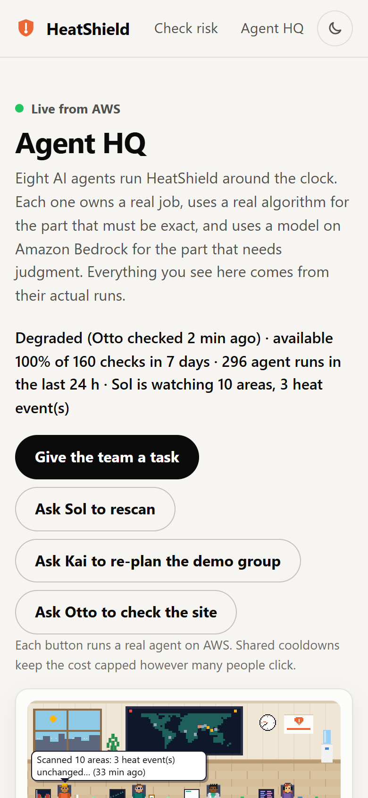
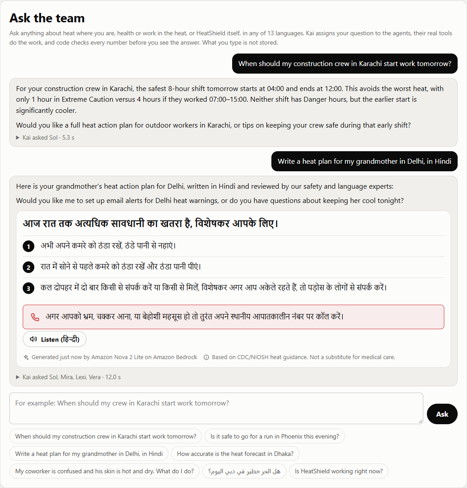
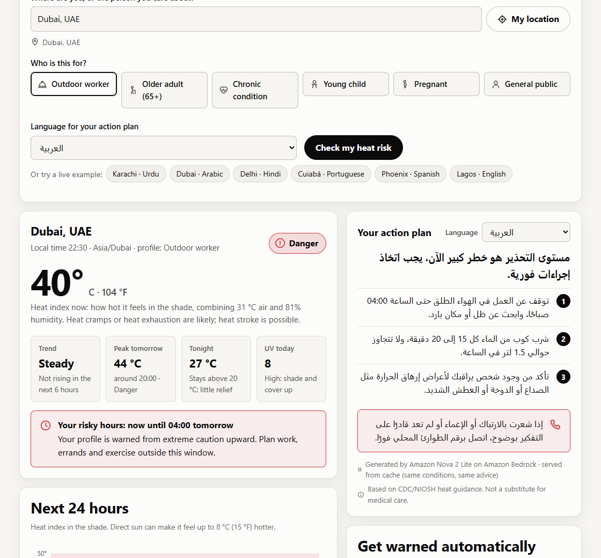
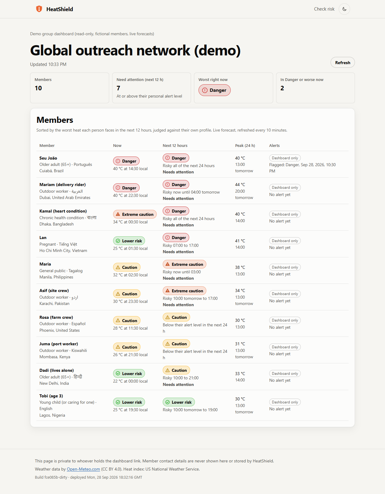
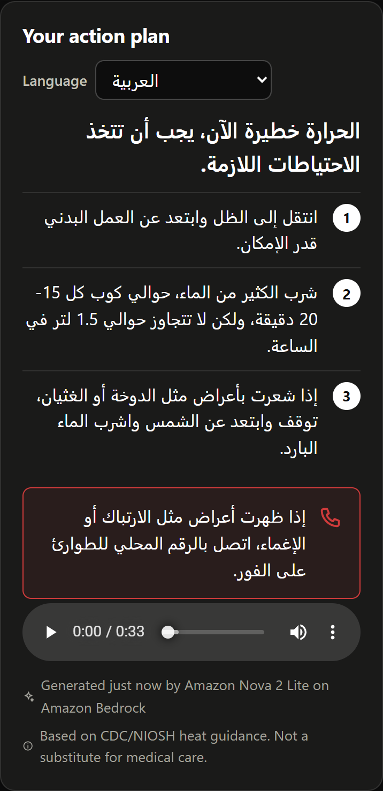

# HeatShield

**A weather app tells you it's 41 °C. HeatShield tells you what to do about it: for your body, your job, and in your language, before the hottest hours arrive.** Eight AI agents run it around the clock on AWS, you can watch them work, and you can ask them anything about the heat where you are.

**Live app: https://d3tda9dyutl7ux.cloudfront.net** · **Agent HQ (the agents, live): https://d3tda9dyutl7ux.cloudfront.net/agents.html**

`#social-good` (Climate resilience) · `#community`

---

## The problem

Heat is linked to an estimated **489,000 deaths a year** worldwide ([WHO](https://www.who.int/news-room/fact-sheets/detail/climate-change-heat-and-health), 2000–2019 average). **2.4 billion of the world's 3.4 billion workers** are likely to be exposed to excessive heat at work, and heat causes an estimated **18,970 work-related deaths a year** ([ILO, April 2024](https://www.ilo.org/resource/news/newly-launched-global-campaign-tackles-impact-heat-stress-workers-worldwide)). Those most at risk are older adults, people with chronic illness, outdoor and manual workers, and people in informal housing without cooling (WHO).

These are exactly the people least likely to get a useful warning. A forecast says "heat index 42 °C". It does not tell a delivery rider in Dubai, a grandmother living alone in Delhi, or a farm crew in Phoenix *what to do between now and tonight*, in a language they read comfortably.

## What HeatShield does: the last mile from forecast to action

1. **Real risk, per person.** Live hourly forecast (temperature + humidity) → the US National Weather Service heat-index formula → NWS risk tier, hour by hour, including when risk will **rise** and **peak**, and the person's **risky hours** today.
2. **Personal thresholds.** Older adults, pregnant people, young children and people with chronic conditions are warned **one tier earlier** than the general public (table below).
3. **An action plan in their language, checked before anyone sees it.** Amazon Bedrock writes a headline, three concrete steps and the warning signs to watch, grounded in vetted CDC/NIOSH guidance, in any of **13 languages** (Arabic and Urdu right-to-left). Two reviewer agents check the language and the safety of every new plan first.
4. **Plans read aloud.** For people who read with difficulty, Amazon Polly reads the plan in its own language: 7 of the 13 languages today (Polly has no Urdu, Bengali, Vietnamese, Indonesian, Tagalog or Swahili voice yet, so those plans have no Listen button rather than a voice for another language).
5. **Warnings they don't have to ask for.** Every hour, EventBridge Scheduler re-checks everyone and Amazon SNS emails people whose risk reaches their level: at most one alert per level per day, never between 21:00 and 06:00 their time.
6. **One person watching out for many.** A foreman, teacher or clinic worker creates a group, shares one invite link, and sees everyone's live risk on a private dashboard, worst first. An agent plans who they should check on first, and for outdoor workers, the safest shift to work tomorrow.
7. **Ask the team.** Type a question in any of the 13 languages ("When should my crew in Karachi start work tomorrow?", "My coworker is confused and his skin is hot and dry") and the agents answer it with their real tools, while code checks every number and every health statement against what the tools and the vetted facts say.

## Eight AI agents, running 24/7

Each agent owns a real job. **An algorithm does the part that must be exact; a model on Amazon Bedrock does the part that needs judgment; code, not the model, makes the final call.**

| Agent | Runs | Job | The exact part (algorithm) | The judgment part (model) | What code guarantees |
|---|---|---|---|---|---|
| **Sol**, Heat Sentinel | every hour | Finds heatwaves in every watched city and writes the situation briefing | [Excess Heat Factor](https://pmc.ncbi.nlm.nih.gov/articles/PMC4306859/) (Nairn & Fawcett 2015) against each city's own 1991–2020 climate, NWS heat-index tiers, the **chance of Danger from the 51-member ECMWF ensemble**, least-squares temperature trend | Which areas need a watch, warning or emergency; the briefing | The level never exceeds the evidence ceiling (with ensemble data, a Danger forecast is a warning only if at least 30% of the members agree); headlines with their chance, and trends, are computed from the numbers; a claim the data cannot support ("cooler than usual") is sent back |
| **Quinn**, Forecast Auditor | daily | Scores how far the forecast can be trusted in each city | Day-ahead and 3-day-ahead forecasts of each day's peak heat index vs what happened, last 14 days: mean error, bias, tier agreement, Danger hits / misses / false alarms | Which facts the team should hear | The model picks claims from a fixed list; code checks each against the scores and writes the sentence; every missed Danger day and false alarm is written by code |
| **Mira**, Health Advisor | every new plan | Writes the personal action plan | Okapi **BM25** retrieval over a library of 22 vetted CDC/NIOSH/NWS facts | The plan, in the person's language | Only enumerated values reach the prompt (no user text); JSON shape, length and script are validated |
| **Lexi**, Language Reviewer | every new plan | Checks the language | Multinomial **naive-Bayes language ID** (free, before any model call) | Literal back-translation and a categorised issue list | Only real errors block (invented words, misspellings, wrong language); wording notes go back as suggestions |
| **Vera**, Safety Reviewer | every new plan | Checks the safety | Deterministic detectors for phone numbers, medicines and doses | Review against the full vetted library with a fixed rubric, then a second reading of any harm objection | Only rule violations block; a harm objection must point at words that are really in the message |
| **Kai**, Community Coordinator | every 3 hours, on request, and for every question in Ask the team | Plans who a group leader should check on first; coordinates the team's answer to your questions | Logistic **urgency score** + **earliest-deadline-first** scheduling across time zones; a sliding-window search for an outdoor worker's **safest 8-hour shift** | The wording of each check-in | The model cannot reorder or invent people; names never reach the model |
| **Iris**, Learning Coach | daily | Turns the reviewer's corrections into a word list for each language | Counts Lexi's word-level corrections over 7 days: spelling and form fixes only, measured on the words that changed; a phrase with conflicting fixes is dropped | A strict second opinion on each proposed entry | Nothing reaches Mira on one reviewer's say-so; code filters out "this word means X here" and style notes before the model sees them |
| **Otto**, Ops Watchdog | every 15 minutes | Keeps the site up and the bill bounded | 5 live probes, **EWMA control charts** on latency, heartbeats for every agent, CloudWatch log scans, AI spend measured from every run | Incident reports (title, likely cause, action) | Triage is deterministic; a model is called only for a new incident; re-runs an agent that missed its schedule; trips the AI budget brake |

A ninth, non-AI worker, the **Dispatcher**, runs the hourly alert check and sends the emails.

**How they work together.** Agents coordinate through shared state in DynamoDB, not by calling each other: Sol publishes heat events that Kai reads; Quinn's track record for each city goes into Sol's evidence; Mira's drafts go to Lexi and Vera, and blocking issues go back to Mira for up to two revisions (if they still fail, the person gets pre-written vetted advice, never a blank screen); Iris turns Lexi's corrections into word lists that Mira gets with every later plan; Otto reads everyone's heartbeat and, when something breaks, writes an incident report that appears on Agent HQ and is emailed to the operator.

**Agent HQ** ([/agents.html](https://d3tda9dyutl7ux.cloudfront.net/agents.html)) shows all of this live: a pixel-art office drawn in code from the real agent log (status lamps, speech from each agent's last real run, a wall map of Sol's cities and heat events), the activity feed, each agent's details, and buttons that run real agents on AWS behind shared cooldowns. "Give the team a task" asks for a plan and replays the review rounds the server actually ran.



| Quinn's forecast audit | Iris's word lists | Agent HQ on a phone |
|---|---|---|
|  |  |  |

**Measured, not assumed.** In the first live measurements, the reviewers were sending plans back for the wrong reasons: 22 of Lexi's 24 blocking objections were really about facts, not language, and Vera blocked "a fan as the main cooling" while quoting a sentence that mentions no fan. We recalibrated in deploy-and-measure rounds with [scripts/eval-guidance.mjs](scripts/eval-guidance.mjs) (one real plan per language): language and safety split cleanly between the two reviewers, code keeps wording complaints and omissions as notes, and a harm objection must survive a second reading that points at the exact words.

| | New plans | Published as AI plans | Pre-written fallback |
|---|---|---|---|
| Before calibration (29 Sep, 11:35–11:43 UTC) | 5 | 1 | 4, including both featured examples (Urdu, Arabic) |
| After calibration (29 Sep, four runs, 13 languages) | 52 | **47 (90%)** | 5, each with a real error the reviewers caught: invented Swahili words (three times), "ice" where "cool" was meant, "thunder" for "confusion" among Hindi heat-stroke signs, a wrong decimal separator |

## Ask the team

On Agent HQ, anyone can type a question in any of the 13 languages. **Kai reads it and assigns the work; each teammate answers with the same tools and algorithms it uses every day**, and the office replays the steps they really took:

| Asked of | Tool (read-only) | What it does |
|---|---|---|
| Sol | `find_place`, `heat_outlook` | Geocodes the place; heat index now, trend, 24-hour peak, risky hours for the profile, 4-day outlook, and the chance of Danger from the 51-member ensemble |
| Quinn | `forecast_track_record` | 14-day forecast audit (his daily report for the cities he covers, so the chat and Agent HQ agree) |
| Mira, Lexi, Vera | `write_action_plan` | A full reviewed plan, shown to the person exactly as Lexi and Vera approved it, with Listen |
| Kai | `safest_shift`, `about_heatshield`, `signup_links` | The safest 8-hour shift; the team handbook; links to the alert and group forms (the model can register nothing) |
| Vera | `vetted_facts` | BM25 over the 22 vetted CDC/NIOSH/NWS facts, for every health question |
| Otto, Iris | `system_status`, `learned_words` | Whether HeatShield is up; the words Mira has learned in a language |

**The model is chosen by measurement, not size.** Five Bedrock models ran the same 10 prompts (first-turn tool routing), then the top candidates ran 5 full questions with realistic tool results, each answer checked for numbers no tool had given (30 Sep):

| Model | Routed right | Full questions: answers with invented numbers | Notes |
|---|---|---|---|
| **Kimi K2.5** (chosen) | 10/10 | 1 of 5 (an interval, before it had looked up the facts) | Precise and grounded; mentioned unprompted that the safest shift is still all Extreme Caution; 2–5.5 s |
| Amazon Nova Pro (fallback) | 10/10 | 1 of 5 ("the most dangerous hours are 11:00 to 14:00") | Called the heat index "the temperature" in Arabic; 2–6 s |
| gpt-oss-120b | 10/10 | 4 of 5, including a "999" phone number | Verbose |
| Mistral Large 3 (675B) | 10/10 | — | Printed 2 of 5 tool calls as text; told a rider to "check back in 30 sec" |
| DeepSeek V3.2, Llama 4 Maverick | 9/10 | not run | Asked instead of acting; called a tool for a poem request |

No model is trusted to be right, so **code decides what the answer may say**:
- every number must come from the question, a tool result or the vetted facts (digits in Arabic, Urdu, Hindi and Bengali script count too); a failed check sends the answer back once, then the sentences that still fail are removed;
- a health question must be answered from Vera's vetted facts, with no added steps; heat-stroke signs mean the first sentence tells the person to call their local emergency number (if not, the answer goes back, and then code moves that sentence to the front);
- Vera's detectors (no phone numbers, medicines or doses), no links except HeatShield's own pages, and a reviewed plan is never retold by the model;
- the answer's language comes from Lexi's language identification.

Every tool is read-only, so a question cannot send an email or change data. Questions are limited to 500 characters, API Gateway throttles the route, at most 30 questions per 10 minutes are answered for everyone together, and the AI kill switch and daily budget apply. **What people type is not stored**: the log records the language, which agents helped, the model and its tokens. Measured on 30 Sep: 24 questions, all answered by Kimi K2.5, **about US$0.003 each**, median 3.7 s (90th percentile 8.0 s).



## Always on, and under control

HeatShield has to work at 3 a.m. during a heatwave with nobody watching, and it calls paid models from a public page. So it runs itself, repairs itself, reports to a person when it can't, and cannot overspend.

- **Nothing to forget to start.** Six EventBridge schedules run the Dispatcher and the five scheduled agents; there are no servers.
- **Failures are retried, then kept.** A failed scheduled run is retried once, then lands in an **Amazon SQS** dead-letter queue that Otto counts and the operator can inspect.
- **Otto repairs what it can.** If an agent misses its schedule, Otto re-runs it (at most once every 2 hours per agent), and it keeps a 7-day uptime record from its own checks: **available 100% of 166 checks** when these docs were written (30 Sep).
- **Nine CloudWatch alarms** (API errors and 5xx, the Dispatcher and Otto going silent, failed runs, throttles) email the operator through the SNS ops topic, together with Otto's incident reports. All nine were OK on 30 Sep.
- **A hard ceiling on AI spend.** Every run records its model and tokens (and Polly its characters), so spend is measured, not estimated. Otto compares today's spend with the daily budget (US$5 by default) and, when it is reached, stops new AI work and emails the operator once. **Alerts never stop:** the Dispatcher cannot be paused, approved plans are still served from the cache, and anything new gets the pre-written vetted advice.

**Operator console** ([/admin.html](https://d3tda9dyutl7ux.cloudfront.net/admin.html), sign-in required). Behind **Amazon Cognito** (administrator-created accounts only, authorization code + PKCE, an `admins` group that API Gateway's JWT authorizer and the code both check): pause any agent, an AI kill switch, the daily budget, a site-wide notice on every page, run any agent now, recall a cached plan, inspect or clear failed runs, the measured spend per day, plan quality by language, the alarm states, and an audit log of every change (kept 90 days).

## Try it in 60 seconds

| What | Link |
|---|---|
| **Agent HQ**: the eight agents working live; ask them a question | https://d3tda9dyutl7ux.cloudfront.net/agents.html#ask |
| A live result (Karachi, outdoor worker, Urdu) | https://d3tda9dyutl7ux.cloudfront.net/?place=Karachi%2C%20Pakistan&lat=24.86&lon=67.01&profile=outdoor_worker&lang=ur |
| Same idea, Arabic, right-to-left, with **Listen** | https://d3tda9dyutl7ux.cloudfront.net/?place=Dubai%2C%20UAE&lat=25.2&lon=55.27&profile=outdoor_worker&lang=ar |
| The community-leader dashboard (read-only demo, 10 fictional members in 10 real hot cities) | https://d3tda9dyutl7ux.cloudfront.net/group.html#g=5NpOU_pMXAK_&k=Q51QdY6DIZK7P4pLCF9B8KAiofrIcFgj |
| The agents' live state as JSON | https://d3tda9dyutl7ux.cloudfront.net/api/agents |
| Health endpoint | https://d3tda9dyutl7ux.cloudfront.net/api/health |

Everything on those pages is computed live from the current forecast and the agents' real runs. Nothing is hard-coded.

| Personal result: Dubai, outdoor worker, Arabic | Community-leader dashboard | Listen: the plan read aloud (Arabic, phone) |
|---|---|---|
|  |  |  |

*Screenshots of the live site, captured by automated headless-Chrome runs (28–30 Sep 2026).*

## Architecture


Fully serverless, defined in one AWS SAM template ([infra/template.yaml](infra/template.yaml)), deployed with one command.

| AWS service | Why it is the right tool here |
|---|---|
| **Amazon Bedrock** (Converse API, tool use) | The judgment half of every agent. **Amazon Nova 2 Lite** writes plans and runs Sol, Quinn, Kai and Otto; **Amazon Nova Pro** reviews and gives Iris's second opinion, so a different model checks the writer's work (it also writes a plan if Nova 2 Lite fails twice). **Claude Haiku 4.5** is configured as the primary writer and takes over automatically once Anthropic model access is enabled on the account; until then every plan falls through to Nova. Pre-written vetted guidance is the last resort. **Kimi K2.5** (Moonshot AI, on-demand in Bedrock) coordinates Ask the team, chosen by measurement over four other models, with Nova Pro as its fallback. |
| **Amazon Polly** (neural voices) | Reads an approved plan aloud in its own language. Only text HeatShield wrote can be spoken (a reviewed plan or pre-written advice, by key; a request never carries text), each text is synthesized once, and the audio is served by CloudFront from S3. |
| **AWS Lambda** (Node.js 22, arm64/Graviton) | Nine functions with separate least-privilege roles: public API, enrollment API, admin API, Dispatcher, Sol, Quinn, Kai, Iris and Otto. Zero runtime dependencies beyond the AWS SDK. |
| **Amazon API Gateway** (HTTP API) | Routes plus per-route throttling on a public endpoint that calls paid models; the agent-run buttons are throttled harder and have shared cooldowns; a JWT authorizer (Amazon Cognito) guards the admin routes. |
| **Amazon Cognito** | Operator sign-in for the admin console: no self sign-up, PKCE, and an `admins` group. |
| **Amazon DynamoDB** (on-demand) | Groups, Locations (sparse GSI per group), Alerts (atomic dedupe), GuidanceCache (TTL), and **AgentLog**: every agent run (14-day TTL), the shared state agents coordinate through, the operator's settings, and the audit log. |
| **Amazon EventBridge Scheduler** | Six schedules: Dispatcher hourly, Sol hourly at :05, Kai every 3 hours, Otto every 15 minutes, Quinn daily at 01:30 UTC, Iris daily at 02:30 UTC. This is what makes it *early warning* rather than a dashboard you must remember to open. |
| **Amazon SNS** | Email alerts (one topic; each subscriber has a filter policy on their own ID, so a publish reaches exactly one person; AWS handles double opt-in and unsubscribe) and an ops topic for incident reports, the budget brake and alarms. |
| **Amazon SQS** | The dead-letter queue for scheduled runs that still fail after one retry. |
| **Amazon CloudWatch** | Structured JSON logs that Otto reads (`FilterLogEvents`) to find the real error before deciding what it means, and nine alarms. |
| **Amazon S3 + CloudFront** | Private bucket (Origin Access Control), one HTTPS URL for site, API and audio, strict CSP and HSTS headers, served from every edge location because users are worldwide. |
| **AWS X-Ray** | Tracing on every function. |

## The science (so the warnings can be trusted)

- **Heat index:** the NWS Rothfusz regression with both NWS humidity adjustments ([source](https://www.wpc.ncep.noaa.gov/html/heatindex_equation.shtml)). Unit tests pin it to 16 reference values generated independently with [MetPy](https://unidata.github.io/MetPy/), covering both adjustment cases.
- **Tiers:** NWS classification ([source](https://www.weather.gov/ama/heatindex)): Caution ≥ 80 °F (26.7 °C), Extreme Caution ≥ 90 °F (32.2 °C), Danger ≥ 103 °F (39.4 °C), Extreme Danger ≥ 125 °F (51.7 °C).
- **Heatwaves relative to local climate:** Sol computes the Excess Heat Factor (Nairn & Fawcett 2015, the method behind Australia's national heatwave service) against each city's own 1991–2020 95th percentile from the ERA5 reanalysis, because 41 °C is normal in Dubai in August and a crisis in Paris.
- **How likely, not just how hot:** one forecast is one possible future. Sol reads the 51 members of the ECMWF ensemble for each city and computes, per day, the share of members that reach Danger and Extreme Danger. On 30 Sep, Dubai's dangerous heat was forecast by every member (100%), while Ho Chi Minh City's single Danger day was forecast by 16%, so Sol kept it at a watch.
- **How far to trust the forecast:** Quinn compares the day-ahead and 3-day-ahead forecasts of each day's peak heat index with the same model's analysis of that day, over the last 14 days. On 30 Sep, across 10 cities: off by 1 °C on average one day ahead and 1.4 °C three days ahead; every one of Dubai's 14 Danger days was called; Dhaka had 2 missed Danger days and 3 false alarms.
- **Safer hours, not just warnings:** for outdoor workers, Kai slides an 8-hour window over the next 36 hours of forecast and picks the start between 04:00 and 10:00 with the fewest Danger hours, then the least heat above Extreme Caution. For the demo group's Dubai delivery rider on 1 Oct: 04:00–12:00 has no Danger hours (all 8 are still Extreme Caution); the usual 07:00–15:00 has 3.
- **Profile-adjusted alert thresholds** (the heat index is objective; *when we warn you* is personal):

| Profile | Alerted from | Why |
|---|---|---|
| Older adult (65+) | Caution | Less able to regulate body temperature; disproportionately represented in heat deaths |
| Chronic condition | Caution | Heart, lung, kidney disease, diabetes and some medicines raise risk |
| Young child | Caution | Depends on others; can't cool themselves or ask for water |
| Pregnant | Caution | Recognized heat-vulnerable group |
| Outdoor worker | Extreme Caution | Hours of exposure and exertion; NWS values assume shade, and full sun can add up to 15 °F |
| General public | Extreme Caution | Baseline |

- **Early warning, not current weather:** 6-hour trend, 24-hour peak time, contiguous risky-hours window, 4-day outlook, and whether the night stays above 20 °C (a "tropical night": no overnight relief).

## Why the AI layer is built this way

- **Plans, alerts and briefings never see user text.** Their prompts are built only from enumerated values: tiers, clock hours, profile, language, UV bucket, and group members' names never leave the leader's dashboard. The one place a person's own words reach a model is Ask the team, where every tool is read-only, the answer is checked by code before it is shown, and nothing typed is stored.
- **Caching is exact and spend is bounded.** Approved plans are cached in DynamoDB under a hash of the exact prompt inputs, so two workers at the same site get the same advice from one set of Bedrock calls, and a public endpoint cannot be used to mint unlimited unique prompts. The same holds for speech: audio is named by a hash of the exact words and voice.
- **Grounded, not creative.** Mira gets only facts retrieved from the vetted library (for example 1 cup / 240 ml every 15–20 minutes and no more than about 1.5 L an hour for working in heat); Vera judges against the whole library. No invented numbers, medicines or phone numbers: a detector blocks them before any model is asked.
- **Code decides what is true.** Reviewer models label each issue and code decides whether it blocks. Quinn's model picks claims and code checks them against the scores. Sol's model chooses levels under a ceiling code computed. Iris's model gives a second opinion on entries that code already filtered. Kai's answers in Ask the team may use only numbers the tools returned.
- **Every failure has a path.** Unusable model output gets one more sample, then the next model, then pre-written guidance. A person at risk never sees a blank screen.

## What a live system taught us

The agents run on real forecasts and real traffic, so they hit real problems. Each one became a fix and a regression test named after the event ([infra/tests/regressions.test.mjs](infra/tests/regressions.test.mjs), [infra/tests/learning.test.mjs](infra/tests/learning.test.mjs)). Examples:

- **Open-Meteo rate limits.** Open-Meteo limits requests per IP, and Lambda shares outbound IPs with other AWS customers. Sol now retries after a pause and keeps a city's last good data (marked stale, up to 3 hours), instead of silently dropping a heat watch.
- **Words that were wrong.** A model headline put dangerous heat on a Thursday that the forecast rated one tier lower, so headlines are now written from the numbers.
- **Fact-checking the new agents (30 Sep).** We read the first live output of each new agent against the numbers:
  - Quinn's first note called Karachi's Danger record "perfect"; the forecast had missed 2 Danger days. Quinn now picks claims and code writes the sentences.
  - Its next reply was the prompt's own example, copied, so claims are now checked while the model can still fix them, and every Danger error is written by code.
  - Iris's first list told Mira to write "dizziness" instead of "unconsciousness" in Urdu, which would have dropped a heat-stroke sign, and turned an Arabic "severe" into "high". Only spelling and form fixes are kept now, measured on the words that changed; 35 entries became 14.
  - Sol wrote "Ho Chi Minh City and Dhaka are cooler than usual"; HeatShield measures unusual heat only. That claim is now sent back.
- **The watchdog's blind spot.** Otto marked the site degraded over 10 failed calls to the primary model: every one was the known setup state (the Anthropic use-case form, not an outage). Otto counted log events across pages but read the lines from the first page only, and CloudWatch Logs can return an empty first page. It reads every page now.
- **Reviewers refuted by the message itself.** A correct Arabic plan went to the English fallback: Vera's last objection proposed the sentence as written as its own "fix", and the one before asked for more heat-stroke signs while the help sentence already named the emergency number. Objections the message itself refutes are now notes.
- **Ask the team, first live answers.** Kai retold a reviewed Hindi plan in its own words (the plan is now shown exactly as reviewed), put "call emergency services" last in a heat-stroke answer (it must come first), and once answered a first-aid question without looking up the vetted facts (health questions now require them; the library gained the NIOSH heat-stroke first-aid steps, checked against the NIOSH page).
- **A limit we did not set.** Thirteen plan requests at once got three HTTP 503s: this new AWS account could run only 10 Lambda functions at once (the usual default is 1,000). The account's quota was raised to 1,000 the same day (confirmed with `GetAccountSettings`), and the page also retries a refused read.

## Cost

Measured from the agent log, with prices from the AWS Price List API (Nova 2 Lite US$0.33/US$2.75 and Nova Pro US$0.80/US$3.20 per million input/output tokens; Polly neural US$16 per million characters):

- **About US$0.008 per new plan** (writer + two reviewers, including revisions): US$0.84 for 111 new plans and 107 revisions on the busiest testing day (29 Sep). Cached plans cost nothing.
- **About US$0.005 per plan read aloud**, once per text (965 characters for 3 plans on 30 Sep); replays are served from S3.
- **About US$0.003 per question in Ask the team** (Kimi K2.5 at US$0.60/US$3.00 per million tokens; 24 questions cost US$0.07 on 30 Sep), plus a plan's cost when a new plan is written for it.
- **Background agents about US$0.05–0.10 a day** (Sol, Kai and Otto cost US$0.06 on 29 Sep; Quinn and Iris about US$0.01 a day).
- The daily AI budget (US$5 by default) caps the worst case. Lambda, DynamoDB on-demand, API Gateway, CloudFront, SNS, SQS and the nine alarms stay within or near the free tier at this scale.

## Security and privacy

- Coordinates are rounded to ~1 km before they are stored or sent anywhere; Sol's public map uses city-level coordinates (~11 km) and shows no head counts.
- **Email addresses are never stored in our database.** They live only inside the SNS subscription. Every alert has an unsubscribe link, and one click on the personal page deletes the registration, alert history and subscription. A leader can delete the whole group, with every member's data, from the dashboard.
- No accounts or passwords for the public. Group dashboards and personal pages use 192-bit bearer links; only SHA-256 hashes are stored, comparisons are constant-time, and the secret lives in the URL `#fragment`, which browsers never send to servers.
- The operator console needs an Amazon Cognito ID token from the `admins` group, checked by API Gateway and again in code; every change is written to an audit log.
- Strict Content-Security-Policy (`script-src 'self'`, no inline scripts or styles), HSTS, `X-Frame-Options: DENY`; all user text is rendered with `textContent`.
- IAM: one managed policy allows `bedrock:InvokeModel` on exactly the inference profiles HeatShield uses; Otto can read only this stack's log groups and invoke only this stack's functions; the public API can write only under `audio/` in the site bucket.
- The public demo group is read-only, so the demo dashboard link can be shared without being vandalized.

## How Claude Code built this

The development process is logged with real command output in [docs/BUILD_LOG.md](docs/BUILD_LOG.md). Highlights:

1. **Connected to AWS through the official AWS Agent Toolkit:** browser `aws login`, then the AWS MCP Server. The Bedrock model IDs came from a real `ListInferenceProfiles` call made through the MCP server; Polly's voices from a real `DescribeVoices` call, each tested with a sentence in its language before any code used it. The agents' live behaviour was investigated through the MCP server too (DynamoDB agent-log queries, CloudWatch Logs searches, Lambda invocations).
2. **Checked facts before coding them:** NWS formula, the Excess Heat Factor paper, CDC/NIOSH guidance, WHO/ILO statistics, model and service prices, Open-Meteo response shapes and AWS API behaviour were all taken from primary sources first.
3. **Proved the heat-index code against an independent implementation** (MetPy), and found by reading MetPy's source that its low-temperature shortcut differs from the NWS text.
4. **Tested in a real browser, against production.** Headless Chrome drives the whole flow, from checking risk to deleting a group ([scripts/e2e/](scripts/e2e/)), plus every Agent HQ button, and fails on any console error, broken step or horizontal overflow.
5. **Deployed, measured, and fixed in loops.** Every agent change was deployed, run live, read back from DynamoDB and CloudWatch, and checked against the forecast before it was called done, including a fact-check of each new agent's first real output.

## Run it yourself

```bash
npm test                        # 153 unit and regression tests, no AWS needed
npm run dev                     # http://localhost:8787 — real weather, in-memory data, Bedrock stubbed
HEATSHIELD_PROXY=https://<site> PORT=8788 node scripts/dev-server.mjs   # local UI against the live agents
npm run deploy                  # test -> lint -> sam build/deploy -> upload site -> smoke test -> Otto post-deploy check
node scripts/eval-guidance.mjs --shift 1                                # live review-pipeline evaluation (about US$0.01 a plan)
npm i --no-save playwright-core && node scripts/e2e/live-flow.cjs      # end-to-end test in your installed Chrome
node scripts/e2e/agent-hq.cjs --run-agents                              # Agent HQ, pressing every button (a few US cents)
npm run seed:demo               # create the read-only demo group through the live API
```

Deploying needs the AWS CLI, AWS SAM CLI and Node 22+. Stack parameters (Bedrock model IDs) are in [infra/params.json](infra/params.json). To use the operator console, create a user in the stack's Cognito user pool and add it to the `admins` group.

Manually trigger one real alert (used for the demo proof):

```bash
aws lambda invoke --function-name <AlertCheckFunctionName> \
  --cli-binary-format raw-in-base64-out --payload '{"forceLocationId":"<locationId>"}' out.json
```

## Honest limitations

- The heat index is a shade value. Occupational standards also use WBGT (wet-bulb globe temperature), which needs solar and wind inputs that we don't have. We state the "full sun adds up to 8 °C / 15 °F" caveat on screen and in guidance instead of pretending otherwise.
- Reviewer agents are models too. After calibration, 90% of new plans in our 13-language evaluation were published and every rejected one contained a real error, but a model reviewer can still miss an error or object to a correct sentence. Swahili is the writer's weakest language.
- **Pre-written fallback advice exists in English, Spanish and French only.** If a plan in another language is rejected or no model is available, the person sees English advice with a notice (and Listen reads that English). We chose not to ship hand-made translations of safety advice that no native speaker has checked.
- Listen covers 7 of the 13 languages; the other 6 have no Amazon Polly voice.
- Ask the team checks numbers, links, safety words and the emergency sentence in code, but advice given in words (for example "avoid going out in the afternoon") is only as good as the model's reading of the tools. Health questions are recognised in code in English; in other languages the model is instructed, not forced, to use the vetted facts.
- Quinn scores the forecast against the same model's own analysis of each day, not against weather stations, so it measures how the forecast changes as the day approaches, not instrument truth. The ensemble chances come from one model (ECMWF) and are not yet calibrated against observations.
- Claude Haiku 4.5 is wired as the primary writer, but Anthropic models need a one-time use-case form on the AWS account; until it is submitted, Amazon Nova writes every plan (Otto reports this as a setup note, not an outage).
- Email is the live alert channel. SMS via SNS needs registered origination numbers in many countries (weeks of paperwork), so we do not claim it.
- One AWS region. The services are managed and multi-AZ, but there is no second-region failover.
- Agent HQ is an illustration: the office is pixel art, but every status, line of speech, map dot and number in it comes from real agent runs. Its 24-hour counts read each agent's latest runs, so busy agents show a lower bound ("40+").
- HeatShield gives safety information, not medical care.
- Weather data: [Open-Meteo](https://open-meteo.com/) (CC BY 4.0, free for non-commercial use; historical climate from the ERA5 reanalysis, ensemble from ECMWF, via Open-Meteo).

## Repository map

```
frontend/                  static site (no framework): index, join, group (leader dashboard), me (personal page),
                           agents.html + js/pixel-office.js, js/office-live.js, js/agents-page.js (Agent HQ),
                           admin.html + js/admin.js (operator console)
infra/template.yaml        the whole AWS stack (SAM)
infra/functions/lib/       heat.mjs (risk engine), guidance.mjs (Mira + review loop), speech.mjs (Listen, Polly),
                           ask.mjs (Ask the team: Kai's tools and the answer checks), handbook.mjs (the team handbook),
                           alert-runner.mjs (Dispatcher), agent-runtime.mjs (Bedrock tool-use loop), agent-log.mjs,
                           agents-api.mjs, admin-routes.mjs, control.mjs (pauses, budget), spend.mjs, logs-reader.mjs
infra/functions/lib/agents/        sentinel (Sol), auditor (Quinn), language-reviewer (Lexi), safety-reviewer (Vera),
                                   coordinator (Kai), coach (Iris), watchdog (Otto), facts.mjs (the vetted library)
infra/functions/lib/algorithms/    ehf.mjs, ensemble.mjs, verification.mjs, bm25.mjs, langid.mjs, stats.mjs (OLS, EWMA)
infra/tests/               node --test suite, including regressions.test.mjs and learning.test.mjs (one test per live incident)
scripts/                   deploy, eval-guidance, seed-demo, local dev server; e2e/ (headless-Chrome tests of the live site)
docs/                      BUILD_LOG.md (development process + AWS connection proof), architecture.svg, screenshots
.claude/skills/            the playbooks Claude Code followed for each part of the build
```

## License

MIT, see [LICENSE](LICENSE).
